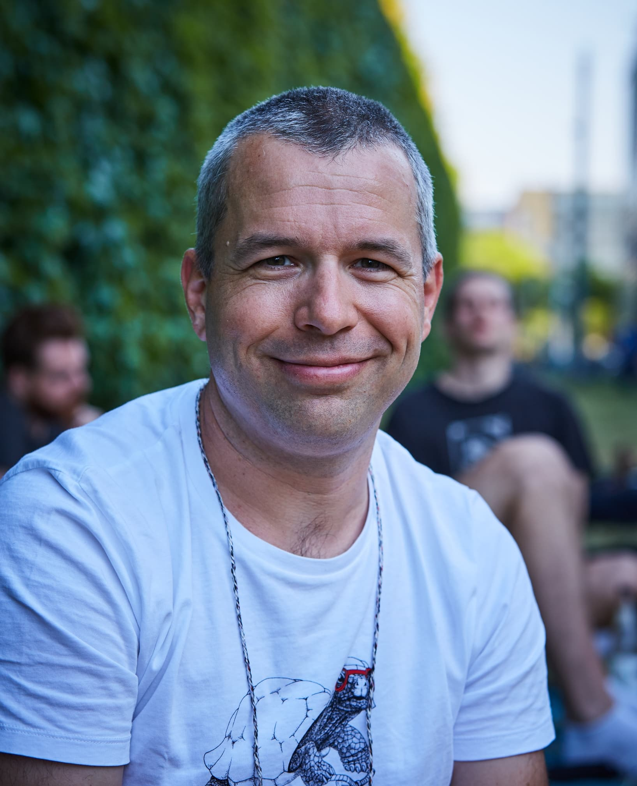

+++
title = "About Me"
+++

# About Me

<small>Photo: CC-BY 4.0 Florian »Cheatha« Köhler</small>

My name is Florian Posdziech. I'm a software [developer](/categories/tech/ "blog articles from category tech"), [musician](/categories/music/ "music-related blog posts"), [athlete](/categories/training/), and
occasional [podcaster](/categories/podcast/). I am currently working as a backend developer for
[ioki](https://ioki.com/) in Frankfurt, Germany.

I like reggae music, baseball, fish tacos, and beer. I've lived, studied and worked in the USA, Norway and Mexico. Maybe it shows.

Check my [Now page](/now) to see what I'm up to at the moment.

## What I do

### Music

I play the trombone in the Reggae and Ska band _The Uplifters & Block Ice Horn Section_ from Freiburg.

You'll find our next gigs at [theuplifters.de/konzerte](https://theuplifters.de/konzerte).

### Training

[I run](https://runalyze.com/athlete/flowfx), and I train with kettlebells. Sometimes I join my wife for some CrossFit at our friend's gym [muskeltiere](https://www.muskeltiere-sport.de/) in the Jungbusch.

### Coding

I do most of my coding for work, so the only public repositories that I regularly touch are my configuration files:

- [My dotfiles](https://codeberg.org/flowfx/dotfiles) for Vim, tmux, zsh, i3, and such, and
- [my Emacs configuration](https://codeberg.org/flowfx/emacs.d).

### Podcasts

Sometimes I talk into a microphone.

**[Several Ways To Live (in Mexico City)](https://severalwaystolive.com/)**: An English podcast that I record together with my friend [Nick Farr](https://chaos.social/web/accounts/1767). It used to be about Mexican food and culture. Now it's something else.

**[Tacos und Limetten](https://tacosundlimetten.de/)**: A German podcast where I talk to fellow and former expats in Mexico City.

**[Cultural Comments - der C3S-Podcast](https://podcast.c3s.cc/)**: A German podcast by and for the C3S, an upcoming alternative to the GEMA collecting sociaty.

---

## More of my stuff on the interwebs

- [Florian Op Tour](https://florianoptour.de/)
- [flowfx @ Codeberg](https://codeberg.org/flowfx/)
- [flowfx @ GitHub](https://github.com/flowfx/)
